# `Deno` 环境下开发`Oak-orm-mysql-reactjs`全栈应用

- [`Deno` 环境下开发`Oak-orm-mysql-reactjs`全栈应用](#deno-环境下开发oak-orm-mysql-reactjs全栈应用)
  - [一、什么是 Deno？](#一什么是deno)
    - [（一）基于 JavaScript 语言的现代功能](#一基于-javascript-语言的现代功能)
    - [（二）安装 Deno](#二安装-deno)
    - [（三）命令行](#三命令行)
    - [（四）命令行选项](#四命令行选项)
    - [（五）Deno 代码示例](#五deno-代码示例)
    - [（六） 标准库](#六-标准库)
  - [二、全栈应用 一个简单的例子](#二全栈应用-一个简单的例子)
    - [（一）项目的基本目录如下](#一项目的基本目录如下)
    - [（二）建立项目文件夹](#二建立项目文件夹)
    - [（三）集中管理依赖](#三集中管理依赖)
    - [（四）创建 env.ts](#四创建envts)
    - [（五）创建 server.ts 文件](#五创建-serverts-文件)
    - [（六）启动应用程序](#六启动应用程序)
    - [（七）创建路由器](#七创建路由器)
    - [（八）添加控制器，api 调用功能：](#八添加控制器api调用功能)
    - [（九）实现增删改查方法](#九实现增删改查方法)
      - [1. 查询数据方法：](#1-查询数据方法)
      - [2. 新数据方法：](#2-新数据方法)
      - [3. 更新删除的方法：](#3-更新删除的方法)
    - [（十）Mysql 和 ORM 支持](#十mysql和orm-支持)
      - [1. 模型 Model](#1-模型-model)
      - [2. 数据库的连接](#2-数据库的连接)
      - [3. 数据库连接的配置](#3-数据库连接的配置)
    - [（十一）引入密码验证](#十一引入密码验证)
  - [三、客户端的尝试](#三客户端的尝试)
    - [（一） Reactjs 支持](#一-reactjs支持)
    - [（二） 设置 App 组件](#二-设置-app-组件)
    - [（三）设定路由](#三设定路由)
      - [使用帮助器进行实际渲染](#使用帮助器进行实际渲染)
    - [（四）页面和组件](#四页面和组件)
      - [1. App 组件](#1-app-组件)
      - [2. LoginComponent 组件](#2-logincomponent-组件)
  - [四、调试 Deno](#四调试-deno)
    - [（一）Chrome Devtools](#一chrome-devtools)
    - [（二）VSCode](#二vscode)
  - [源码地址](#源码地址)
  - [更多参考资源](#更多参考资源)

## 一、什么是 Deno

Deno 是基于 V8 JavaScript 引擎和 Rust 编程语言的 JavaScript 和 TypeScript 运行时，默认使用安全环境执行代码。

它由 Node.js 的原始创建者 Ryan Dahl 创建，专注于安全性和生产力。

Deno 建立在 V8、Rust 和 Tokio 的基础上。

两种发音，"德诺"和"蒂诺"，"蒂诺"这个发音应该更合适一些，因为 Deno 的标志是一只恐龙。恐龙（dinosaur）的英文缩写正是 dino。

Deno 就像 Node，但是在很多方面都得到了深入的改善。

写这篇文章时，`deno`刚刚发布了`1.1.0`的最喜版本，修复了大量 bug，优化了执行效率。

先从 Deno 功能列表开始：

### （一）基于 JavaScript 语言的现代功能

- 全面的标准库
- 包括 TypeScript 支持
- 包含 ES 模块
- 没有包管理器
- 有一流的 await
- 内置测试功能
- 与浏览器保持兼容，内置 fetch 和全局 window 对象

### （二）安装 Deno

我使用的`windows 10`上面的`wsl debian buster`系统。可以这样安装

打开`cmd`命令行，并输入`wsl`或`bash`

然后输入:

```bash
curl -fsSL https://deno.land/x/install/install.sh | sh
```

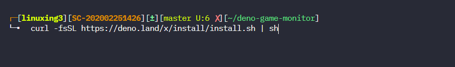

Tips:

PowerShell (Windows):

```bash
iwr https://deno.land/x/install/install.ps1 -useb | iex
```

Homebrew (Mac):

```bash
brew install deno
```

Chocolatey (Windows):

```bash
choco install deno
```

### （三）命令行

在`~/.bashrc`设置好环境变量

```bash
export DENO_INSTALL="$HOME/.deno"
export PATH="$DENO_INSTALL/bin:$PATH"
```

一旦完成，你将可以访问 `deno` 命令。用 `deno --help` 获得帮助：

```bash

deno --help

deno 1.1.0

A secure JavaScript and TypeScript runtime

Docs: https://deno.land/std/manual.md
Modules: https://deno.land/std/ https://deno.land/x/
Bugs: https://github.com/denoland/deno/issues

To start the REPL, supply no arguments:
  deno

To execute a script:
  deno run https://deno.land/std/examples/welcome.ts
  deno https://deno.land/std/examples/welcome.ts

To evaluate code in the shell:
  deno eval "console.log(30933 + 404)"

Run 'deno help run' for 'run'-specific flags.

USAGE:
    deno [OPTIONS] [SUBCOMMAND]

OPTIONS:
    -h, --help
            Prints help information

    -L, --log-level <log-level>
            Set log level [possible values: debug, info]

    -q, --quiet
            Suppress diagnostic output
            By default, subcommands print human-readable diagnostic messages to stderr.
            If the flag is set, restrict these messages to errors.
    -V, --version
            Prints version information


SUBCOMMANDS:
    bundle         Bundle module and dependencies into single file
    cache          Cache the dependencies
    completions    Generate shell completions
    doc            Show documentation for a module
    eval           Eval script
    fmt            Format source files
    help           Prints this message or the help of the given subcommand(s)
    info           Show info about cache or info related to source file
    install        Install script as an executable
    repl           Read Eval Print Loop
    run            Run a program given a filename or url to the module
    test           Run tests
    types          Print runtime TypeScript declarations
    upgrade        Upgrade deno executable to newest version

ENVIRONMENT VARIABLES:
    DENO_DIR             Set deno's base directory (defaults to $HOME/.deno)
    DENO_INSTALL_ROOT    Set deno install's output directory
                         (defaults to $HOME/.deno/bin)
    NO_COLOR             Set to disable color
    HTTP_PROXY           Proxy address for HTTP requests
                         (module downloads, fetch)
    HTTPS_PROXY          Same but for HTTPS
```

### （四）命令行选项

```bash
--allow-env 允许环境访问
--allow-hrtime 允许高精度的时间测量
--allow-net = 允许网络访问
--allow-plugin 允许加载插件
--allow-read = 允许文件系统读访问
--allow-run 允许运行子进程
--allow-write =允许文件系统写访问
--allow-all 允许所有权限（与 -A 相同）
```

### （五）Deno 代码示例

Deno 网站例子：<https://deno.land/std/examples/。>

### （六） 标准库

- archive： tar 存档工具
- async async utilties
- async：异步工具
- bytes：用来操作字节片段的辅助
- datetime： 日期/时间解析
- encoding ：各种格式的编码/解码功能
- flags： 解析命令行标志
- fmt： 格式化和打印
- fs：文件系统 API
- hash：加密库
- http： HTTP 服务器
- io： I/O 库
- log： 日志实用工具
- mime：支持 multipart 数据
- node： Node.js 兼容性层
- path：路径操作
- ws： websockets

## 二、全栈应用 一个简单的例子

用 `Oak` 构建 `REST API`。 Oak 受到了流行的 Node.js 中间件 Koa 的启发。

构建的 API 非常简单。我们的服务器将会在内存中存储带有名称 密码 电子邮件的数据列表。

- 添加新数据
- 列出数据
- 获取特定数据的详细信息
- 从列表中删除一条数据
- 更新数据的年龄

未来方便建立一个通用的灵活的应用模板，我们提前做好一些设置

### （一）项目的基本目录如下

```bash
.
|-- config
|   |-- db.ts
|   |-- env.ts
|   `-- talent-deno-test.json
|-- controllers
|   |-- auth.ts
|   |-- games.mysql.ts
|   `-- user.ts
|-- deno.json
|-- deps.ts
|-- docs
|   |-- index.md
|   `-- tutorial.md
|-- drun.json
|-- helpers
|   |-- between.ts
|   |-- render.ts
|   `-- request.ts
|-- middleware
|   |-- authorize.ts
|   |-- error.ts
|   |-- logger.ts
|   |-- state.ts
|   `-- timer.ts
|-- models
|   |-- GameModel.ts
|   `-- UserModel.ts
|-- pages
|   |-- app.tsx
|   |-- form.tsx
|   `-- list.tsx
|-- readme.md
|-- routes
|   |-- auth.tsx
|   |-- game.ts
|   `-- home.tsx
|-- server.ts
|-- services
|   |-- crud.sql.ts
|   `-- db.sql.ts
|-- testdeps.ts
|-- tests
|   |-- model_test.ts
|   `-- oak.test.ts
|-- tsconfig.json
`-- types.ts
```

### （二）建立项目文件夹

```bash
mkdir deno-project
cd deno-project
touch deps.ts
deno cache deps.ts
```

### （三）集中管理依赖

我们的`deps.ts`文件，类似于`node`下的`package.json`，方便我们进行一些依赖管理

```typescript
// server
export {
  Application,
  Router,
  Status,
  isHttpError,
} from "https://deno.land/x/oak/mod.ts";
export { oakCors } from "https://deno.land/x/cors/mod.ts";
// React
export { default as React } from "https://dev.jspm.io/react@16.13.1";
export { default as ReactDOMServer } from "https://dev.jspm.io/react-dom@16.13.1/server";
export { default as ReactRouter } from "https://dev.jspm.io/react-router";
export { default as ReactHookForm } from "https://dev.jspm.io/react-hook-form";
// ORM
export {
  dso,
  Client,
  Where,
  Model,
  BaseModel,
  FieldType,
  Field,
} from "https://deno.land/x/dso@v1.0.0/mod.ts";
// services
export {
  cron,
  daily,
  monthly,
  weekly,
} from "https://deno.land/x/deno_cron/cron.ts";
// Helpers
export { config } from "https://deno.land/x/dotenv@v0.4.0/mod.ts";
export { slugify } from "https://deno.land/x/slugify@0.3.0/mod.ts";
export { makeJwt } from "https://deno.land/x/djwt@v0.9.0/create.ts";
export { validateJwt } from "https://deno.land/x/djwt@v0.9.0/validate.ts";
export { hash, compare } from "https://deno.land/x/bcrypt@v0.2.1/mod.ts";
export { v4 } from "https://deno.land/std/uuid/mod.ts";
export { program, Lizard } from "https://deno.land/x/denomander/mod.ts";
export { readJsonSync, writeJsonSync } from "https://deno.land/std/fs/mod.ts";
```

小技巧： 如果你想提前缓存各种依赖

```bash
deno cache --unstable deps.ts
```

### （四）创建 env.ts

```bash
mkdir config
touch config/env.ts
touch .env
```

- 环境配置文件`config/env.ts`

```typescript
import { config } from "../deps.ts";
const env = config();
export default env;
```

- 环境配置数据写在`.env`文件中

```text
HOST=http://0.0.0.0
PORT=8000
TOKEN_SECRET=20090909
DB_HOST=localhost
DB_PORT=3306
DB_DATABASE=monitor
DB_USERNAME=monitor
DB_PASSWORD=20090909
```

然后你可以使用一下方式导入环境变量

```typescript
import env from "./config/env.ts";
env["HOST"];
```

### （五）创建 server.ts 文件

在项目根目录下建立一个`server.ts`文件

从 Oak 导入 `Application` 和 `Router` 对象：

然后得到环境变量 `PORT` 和 `HOST`：

运行并监听

```typescript
import { Application, oakCors } from "./deps.ts";
import env from "./config/env.ts";

// Routes
import homeRouter from "./routes/home.ts";
import authRouter from "./routes/auth.ts";

const host = env["HOST"];
const port = parseInt(env["PORT"]);

// Configure Application
export const app = new Application();

// Builtin middleware
app.use(oakCors()); // Enable CORS for All Routes
app.use(homeRouter.routes()).use(authRouter.routes());
app.use(homeRouter.allowedMethods()).use(authRouter.allowedMethods());

// Bootstrap Application
console.log(`Server running on ${host}:${port}`);
await app.listen({ port });
```

在项目根目录下建立一个`tsconfig.json`文件

因为我们的项目将使用`reactjs`和装饰器，所以启用`experimentalDecorators`和`jsx`两个选项

```json
{
  "compilerOptions": {
    "jsx": "react",
    "allowJs": false,
    "emitDecoratorMetadata": true,
    "experimentalDecorators": true,
    "module": "esnext"
  }
}
```

### （六）启动应用程序

```bash
deno run -A --unstable -c tsconfig.json server.ts
```

然后 Deno 将会下载依赖项，自动运行我们的程序

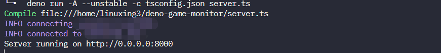

### （七）创建路由器

用户验证的路由 `routes/auth.ts`

```typescript
import { Router } from "../deps.ts";
import { register, login } from "../controllers/auth.ts";
import {
  getUsers,
  getUser,
  addUser,
  updateUser,
  deleteUser,
} from "../controllers/user.ts";

const router = new Router();

router.post("/auth/register", register).post("/auth/login", login);

router
  .get("/api/v1/users", getUsers)
  .get("/api/v1/users", getUser)
  .post("/api/v1/users", register)
  .put("/api/v1/users", updateUser)
  .delete("/api/v1/users", deleteUser);

export default router;
```

我们的`api`接口，是后台服务器的设置

`/auth/register`的接口实现了注册功能
`/auth/login`的接口实现了登录功能

### （八）添加控制器，api 调用功能

用户验证的控制器 `controllers/auth.ts`

当用户向`/auth/register`发送`post`请求时，将调用`register`方法

根据 `Oak` 的设计，控制器的相应方法是一个异步函数，其参数 `ctx` 的类型如下

```typescript
{
  request: any;
  response: any;
  params: any;
}
```

注意使用 `const body = await request.body()` 来获取网络请求 `body` 的内容，值是作为`JSON` 传递的。

数据处理结果直接用于修改 `response` 对象，比如 `status`, `data`, `type`

```typescript
import { Status, compare, makeJwt, hash, config } from "../deps.ts";
import env from "../config/env.ts";
import { findRecord, addRecord } from "../services/crud.sql.ts";
import { userModel } from "../services/db.sql.ts";

export async function register(ctx: any) {
  const body = await ctx.request.body();
  console.log(body);

  // FIXEM: password is hashed and needs long string, over 100
  let checkId = await findRecord(userModel, { name: body.value.name });

  if (!checkId) {
    const password = await hash(body.value.password);
    const user = await addRecord(userModel, {
      name: body.value.name,
      email: body.value.email,
      password,
    });

    ctx.response.status = Status.Created;
    ctx.response.type = "json";
    ctx.response.body = {
      status: "success",
      message: `user registered in database`,
      data: {
        user,
      },
    };
  } else {
    ctx.throw(Status.BadRequest, "User name exits!");
  }
}

export async function login(ctx: any) {
  const body = await ctx.request.body();

  // Find record with name
  let user: any = await findRecord(userModel, { name: body.value.name });

  if (!user) {
    ctx.throw(Status.UnprocessableEntity, "Wrong Email Address!");
  } else if (await compare(body.value.password, user.password)) {
    const token = makeJwt({
      header: { alg: "HS256", typ: "JWT" },
      payload: { id: user.id, name: user.name, email: user.email },
      key: env["TOKEN_SECRET"],
    });
    ctx.response.status = Status.OK;
    ctx.response.type = "json";
    ctx.response.body = {
      status: "success",
      message: `Logged in with ${body.value.email}`,
      data: { accessToken: token },
    };
    // set redirect
  } else {
    ctx.throw(Status.Unauthorized, "Wrong Password!");
  }
}
```

为了便于维护，我们将数据库的后台操作抽象到`services`中，比如从`register`方法中调用`addRecord`,而`addRecord`在单独的一个`crud.sql.ts`中定义

### （九）实现增删改查方法

在`services/crud.sql.ts`文件中定义

#### 1. 查询数据方法

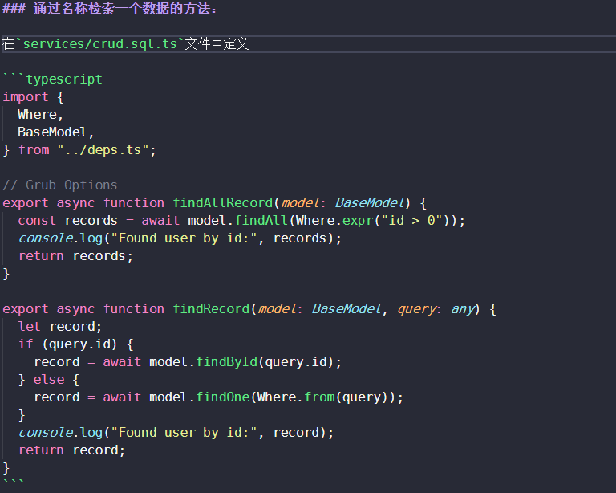

```typescript
import { Where, BaseModel } from "../deps.ts";

// Grub Options
export async function findAllRecord(model: BaseModel) {
  const records = await model.findAll(Where.expr("id > 0"));
  console.log("Found user by id:", records);
  return records;
}

export async function findRecord(model: BaseModel, query: any) {
  let record;
  if (query.id) {
    record = await model.findById(query.id);
  } else {
    record = await model.findOne(Where.from(query));
  }
  console.log("Found user by id:", record);
  return record;
}
```

#### 2. 新数据方法

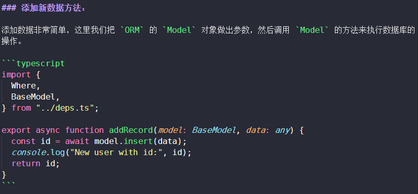

添加数据非常简单，这里我们把 `ORM` 的 `Model` 对象做出参数，然后调用 `Model` 的方法来执行数据库的操作。

```typescript
import { Where, BaseModel } from "../deps.ts";

export async function addRecord(model: BaseModel, data: any) {
  const id = await model.insert(data);
  console.log("New user with id:", id);
  return id;
}
```

#### 3. 更新删除的方法

删除和查询，主要使用 `query` 参数，即一个`JSON`对象，必须包含 `id` 字段作为唯一标识

```typescript
export async function updateRecord(model: BaseModel, query: any) {
  const records = await model.update(query, Where.from({ id: query.id }));
  console.log("Update user with id:", records);
  return records;
}

export async function deleteRecord(model: BaseModel, query: any) {
  const count = await model.delete(Where.from(query));
  console.log(`${count} record deleted`);
  return count;
}
```

### （十）Mysql 和 ORM 支持

我们使用 `dso` 模块来提供 `ORM` 支持，当然你可以使用其他类似模块如 `denodb` 或 `cotton`

不过因为 `deno` 现在还在持续开发，里面不少数据库的坑，说起来都是类。

比如定义模型时，如果密码需要进行 `hash` 处理，这字段就很长，在 `Model` 中要设置足够字段长度，否则服务器会报错，而根本无法排查！

再比如在使用`denodb`时，经常会出现 `compile error` 或 `file not found` 等莫名其妙的错误，希望
随着版本的改进，会消除这些问题。

#### 1. 模型 Model

我们的用户模型包含 `name`, `password`, `email` 三个字段

```typescript
import { BaseModel, Field, FieldType, Model } from "../deps.ts";

// Define a database model
@Model("users")
export class UserModel extends BaseModel {
  @Field({
    type: FieldType.INT,
    primary: true,
    length: 11,
    autoIncrement: true,
  })
  id!: number;

  @Field({ type: FieldType.STRING, length: 30, notNull: true })
  name!: string;

  // FIXEM: password is hashed and needs long string, over 100
  @Field({ type: FieldType.STRING, length: 100, notNull: true })
  password!: string;

  @Field({ type: FieldType.STRING, length: 30 })
  email?: string;
}
```

#### 2. 数据库的连接

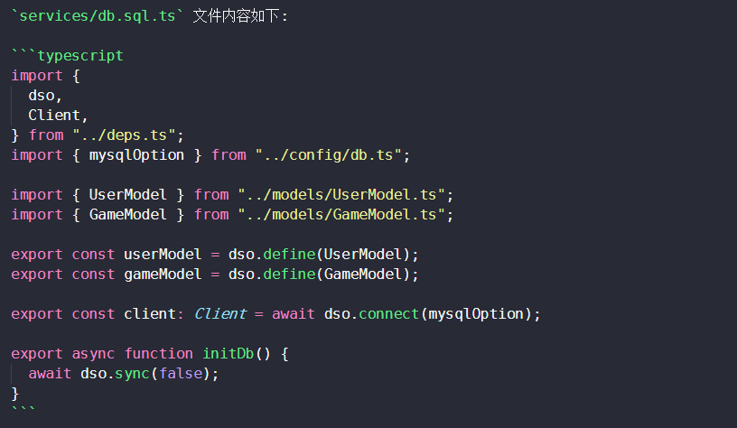

`dso` 是一个简单易用的 `ORM` 项目，其初始化只需要三个步骤就可以

1. 使用定义 `dso.define` 数据表结构，其参数就是 `Model`

2. 启动 `dso.connect` 进行数据库连接

3. 使用 `dso.sync` 进行同步，如果没有相应表格，则会自动创建。注意如果传入 `true` 则会重置数据库，删除所有现有数据

`services/db.sql.ts` 文件内容如下:

```typescript
import { dso, Client } from "../deps.ts";
import { mysqlOption } from "../config/db.ts";

import { UserModel } from "../models/UserModel.ts";
import { GameModel } from "../models/GameModel.ts";

export const userModel = dso.define(UserModel);
export const gameModel = dso.define(GameModel);

export const client: Client = await dso.connect(mysqlOption);

export async function initDb() {
  await dso.sync(false);
}
```

#### 3. 数据库连接的配置

`config/db.ts`

```typescript
import env from "./env.ts";
export const mysqlOption = {
  hostname: env["DB_HOST"],
  port: parseInt(env["DB_PORT"]),
  username: env["DB_USERNAME"],
  password: env["DB_PASSWORD"],
  db: env["DB_DATABASE"],
};
```

### （十一）引入密码验证

可以看到，我们在`controllers/auth.ts` 中的 `login` 方法内使用了 `compare` 方法来校验网络请求中的明文密码和数据库获取的 `hash` 密码，并使用 `makeJwt` 来生成新到 `token`

`controllers/auth.ts` 内容如下：

```typescript
export async function login(ctx: any) {
  const body = await ctx.request.body();

  // Find record with name
  let user: any = await findRecord(userModel, { name: body.value.name });

  if (!user) {
    ctx.throw(Status.UnprocessableEntity, "Wrong Email Address!");
  } else if (await compare(body.value.password, user.password)) {
    const token = makeJwt({
      header: { alg: "HS256", typ: "JWT" },
      payload: { id: user.id, name: user.name, email: user.email },
      key: env["TOKEN_SECRET"],
    });
    ctx.response.status = Status.OK;
    ctx.response.type = "json";
    ctx.response.body = {
      status: "success",
      message: `Logged in with ${body.value.email}`,
      data: { accessToken: token },
    };
    // set redirect
  } else {
    ctx.throw(Status.Unauthorized, "Wrong Password!");
  }
}
```

`middelwares/authorize` 中定义一个中间件，使用 `validateJwt` 实现`jwt` 的验证

```typescript
import { Status, validateJwt, config } from "../deps.ts";

const env = config();

export default async (ctx: any, next: any) => {
  // FIXED: Check authorization
  const authHeader = ctx.request.headers.get("authorization");
  if (!authHeader) {
    ctx.throw(Status.Unauthorized);
  } else {
    const requestToken = authHeader.split(" ")[1];
    try {
      const jwt: any = await validateJwt(requestToken, env["TOKEN_SECRET"]);
      ctx.request.user = jwt.payload;
      await next();
    } catch (err) {
      ctx.throw(Status.Unauthorized);
    }
  }
};
```

我使用 `talent` 的 `chrome talent rest` 插件进行测试，可以参考下图

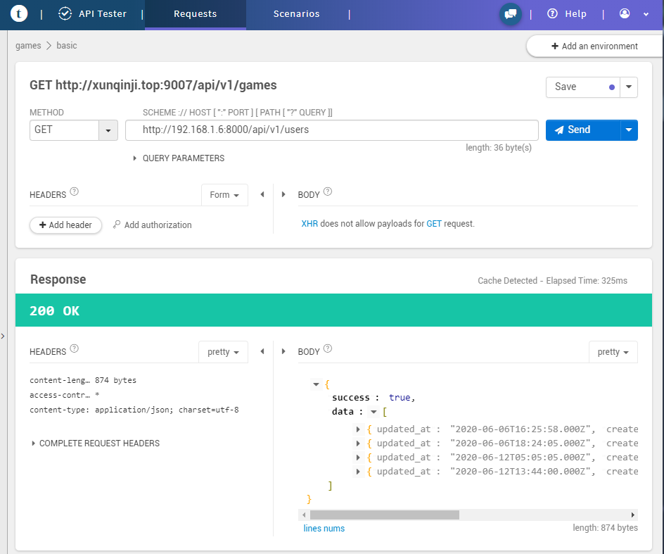

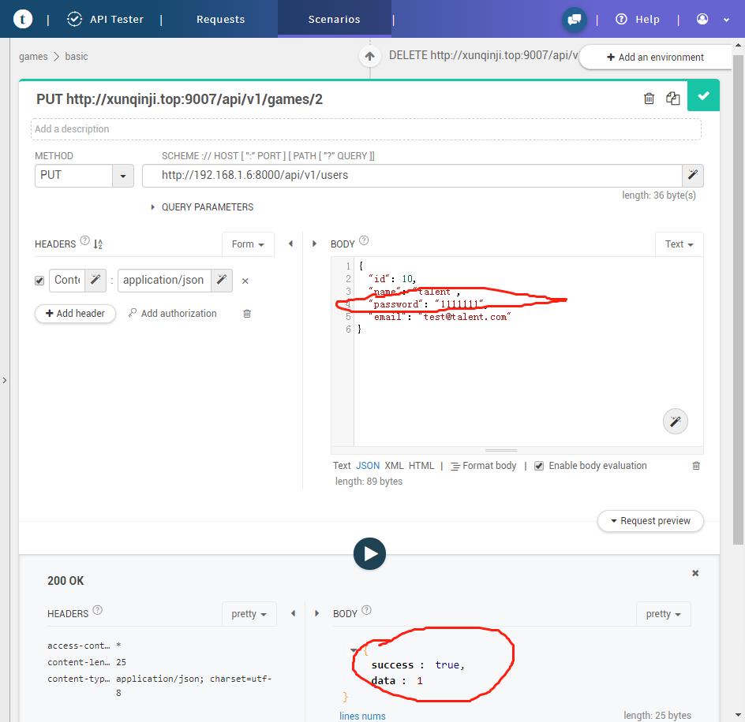

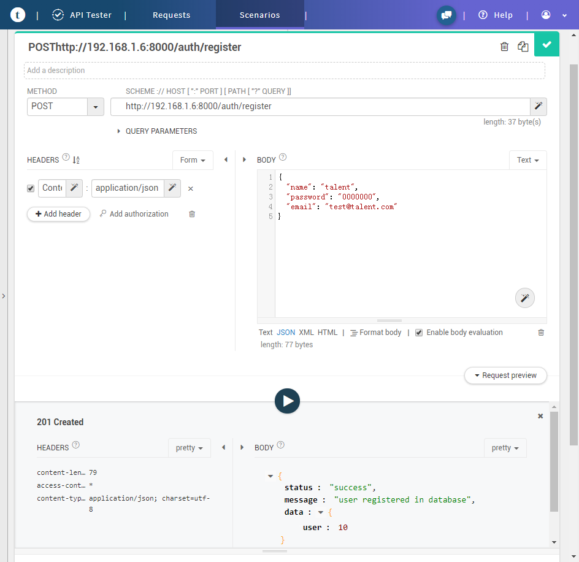

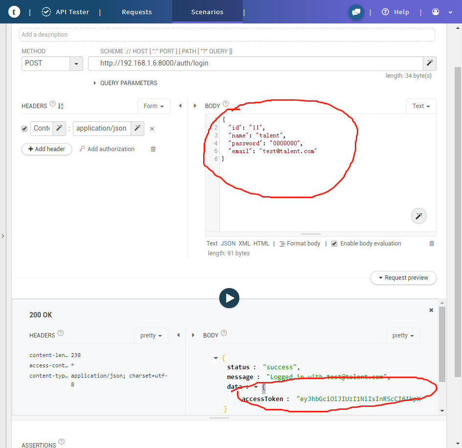

## 三、客户端的尝试

### （一） Reactjs 支持

添加 `reactjs` 支持更加麻烦一些, 主要是服务端和客户端之间的协调问题，具体原理笔者也不太懂，可以参考以下文章和视频

<a href="http://www.youtube.com/watch?feature=player_embedded&v=sKsW2MUWA8c
" target="_blank"></a>

define 2 routes:
one to serve a simple HTML page containing our rendered app,
and another browser.js route to server our app's code
so we can [hydrate] the React application on the client.

简单来说，就是需要定义了 2 个路由

第一个功能是渲染出 `html` 页面，包括被渲染的 `app` 本身

第二个是提供 `browser.js` 脚本，提供我们的 `app` 实现动态功能

### （二） 设置 App 组件

主页面需要用 `Oak` 的路由进行渲染

这里我们需要使用 `react-doom-server` 的 `renderString`，为了更好实现，我使用 `htmlWrapper` 帮助器函数，返回我们需要的服务器可用的组件内容（其实就是字符串格式）

### （三）设定路由

路由 `routes/home.ts` 中内容如下:

```typescript
// @deno-types="https://deno.land/x/types/react/v16.13.1/react.d.ts"
// @deno-types="https://deno.land/x/types/react-dom/v16.13.1/server.d.ts"
import App, { componentMapList } from "../pages/app.tsx";
import { htmlWrapper, jsMultiWrapper } from "../helpers/render.ts";

import { Router, ReactRouter } from "../deps.ts";
const { StaticRouter, BrowserRouter } = ReactRouter;

export interface ComponentMap {
  name: string;
  component: any;
}

export const componentMapList: ComponentMap[] = [
  {
    name: "App",
    component: App,
  },
  {
    name: "LoginComponent",
    component: LoginComponent,
  },
  {
    name: "ListComponent",
    component: ListComponent,
  },
];

// define 2 routes:
// one to serve a simple HTML page containing our rendered app,
// and another browser.js route to server our app's code
// so we can [hydrate] the React application on the client.

// 导入客户端的reactjs
const browserBundlePath = "/browser.js";

const router = new Router();

router.get("/", (ctx: any) => {
  // And then on the server we’ll use the analogous, but stateless StaticRouter component:
  const body = htmlWrapper(App);
  ctx.response.type = "text/html";
  ctx.response.body = body;
});

// 客户端渲染App
router.get(browserBundlePath, ({ response }: { response: any }) => {
  // On the client-side, let’s simply wrap our App component with React Router’s BrowserRouter component:
  const js = jsMultiWrapper(componentMapList);
  response.type = "application/javascript";
  response.body = js;
});

export default router;
```

#### 使用帮助器进行实际渲染

帮助器函数的功能按一下流程实现：

1. 从 `dev.jspm.io` 下引入一系列的库

2. 导入一系列的组件（不过直接导入会报错，因为脚本文件中没有定义相关组件。如果逐个导入则不现实，所以需要包裹一下，将每个组件按名字定义为一个常量）

3. 使用 `ReactDOM.hydrate(React.createElement(App)` 渲染出 `browser.js` 用来支持组建动态功能

4. 使用 `(ReactDOMServer as any).renderToString(component)` 渲染出组件

`helpers/render.ts` 如下：

```typescript
// @deno-types="https://deno.land/x/types/react-dom/v16.13.1/server.d.ts"
import { ReactDOMServer, ReactRouter } from "../deps.ts";
const { StaticRouter, BrowserRouter } = ReactRouter;

const jspms = [
  'import React from "https://dev.jspm.io/react@16.13.1"',
  'import ReactDOM from "https://dev.jspm.io/react-dom@16.13.1"',
  'import ReactRouter from "https://dev.jspm.io/react-router"',
  'import ReactHookForm from "https://dev.jspm.io/react-hook-form"',
];

const libs = jspms.join(";\n");

// 导入客户端的reactjs
export const htmlWrapper = (component: any) => {
  const browserBundlePath = "/browser.js";
  const html = `<html><head><script type="module" src="${browserBundlePath}"></script><link href="https://unpkg.com/tailwindcss@^1.0/dist/tailwind.min.css" rel="stylesheet">
  </head><body><div id="app">${(ReactDOMServer as any).renderToString(
    component
  )}</div></body></html>`;
  const body = new TextEncoder().encode(html);
  return body;
};

export const jsMultiWrapper = (
  components: { name: string; component: any }[]
) => {
  // On the client-side, let’s simply wrap our App component with React Router’s BrowserRouter component:
  const componentLines: string = components.reduce((pre: any, cur: any) => {
    const line = `const ${cur.name} = ${cur.component};`;
    return pre + "\n" + line;
  }, "");
  const js = `${libs};\n${componentLines};\nReactDOM.hydrate(React.createElement(App), document.getElementById("app"));`;
  return js;
};
```

### （四）页面和组件

#### 1. App 组件

主页面 `pages/app.tsx` 的内容如下：

```typescript
// @deno-types="https://deno.land/x/types/react/v16.13.1/react.d.ts"
import { React } from "../deps.ts";
import ListComponent from "./list.tsx";
import LoginComponent from "./form.tsx";

declare global {
  namespace JSX {
    interface IntrinsicElements {
      button: any;
      div: any;
      h1: any;
      p: any;
      a: any;
      ul: any;
      li: any;
      span: any;
      form: any;
      label: any;
      input: any;
    }
  }
}

const App = (props: any) => {
  return (
    <div class="flex">
      <div class="w-2/5">
        <LoginComponent />
      </div>
      <div class="w-3/5">
        <ListComponent />
      </div>
    </div>
  );
};

export default App;
```

#### 2. LoginComponent 组件

这个组件实现实现表单的功能

页面 `pages/form.tsx` 的内容如下：

这里我们尝试添加一些新东西，比如 `tailwindcss` 和 `react-hook-form`， 看看能否组合起来

```typescript
// @deno-types="https://deno.land/x/types/react/v16.13.1/react.d.ts"
import { React, ReactHookForm } from "../deps.ts";
import env from "../config/env.ts";

const LoginComponent = () => {
  const { register, handleSubmit } = (ReactHookForm as any).useForm();

  const onSubmit = async (data: any) => {
    console.log(data);
    // Try login
    const response: any = await fetch("/auth/login", {
      method: "POST",
      headers: {
        "Content-Type": "application/json",
      },
      body: JSON.stringify(data),
    });
    console.log(response);

    // if user exists try login
    if (response.status !== 200) {
      const response: any = await fetch("/auth/register", {
        method: "POST",
        headers: {
          "Content-Type": "application/json",
        },
        body: JSON.stringify(data),
      });
    }
  };

  return (
    <div class="w-full pl-10 pt-50">
      <form
        onSubmit={handleSubmit(onSubmit)}
        class="bg-white shadow-md rounded px-8 pt-6 pb-8 mb-4"
      >
        <div class="mb-4">
          <label class="block text-gray-700 text-sm font-bold mb-2" for="name">
            Username
          </label>
          <input
            name="name"
            class="shadow appearance-none border rounded w-full py-2 px-3 text-gray-700 leading-tight focus:outline-none focus:shadow-outline"
            type="text"
            ref={register}
          />
        </div>
        <div class="mb-4">
          <label class="block text-gray-700 text-sm font-bold mb-2" for="email">
            Email
          </label>
          <input
            name="email"
            class="shadow appearance-none border rounded w-full py-2 px-3 text-gray-700 leading-tight focus:outline-none focus:shadow-outline"
            type="text"
            ref={register}
          />
        </div>
        <div class="mb-6">
          <label
            class="block text-gray-700 text-sm font-bold mb-2"
            for="password"
          >
            Password
          </label>
          <input
            class="shadow appearance-none border border-red-500 rounded w-full py-2 px-3 text-gray-700 mb-3 leading-tight focus:outline-none focus:shadow-outline"
            name="password"
            type="password"
            ref={register}
          />
          <p class="text-red-500 text-xs italic">Please choose a password.</p>
        </div>
        <div class="flex items-center justify-between">
          <input
            class="bg-blue-500 hover:bg-blue-700 text-white font-bold py-2 px-4 rounded focus:outline-none focus:shadow-outline"
            type="submit"
          />
          <a
            class="inline-block align-baseline font-bold text-sm text-blue-500 hover:text-blue-800"
            href="#"
          >
            Forgot Password?
          </a>
        </div>
      </form>
      <p class="text-center text-gray-500 text-xs">
        &copy;2020 Acme Corp. All rights reserved.
      </p>
    </div>
  );
};

export default LoginComponent;
```

访问根目录，显示出我们的 `React App`，添加、删除功能都可以正常运行！太棒了！

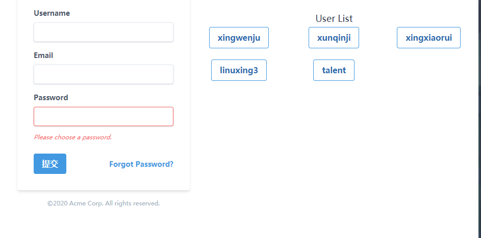

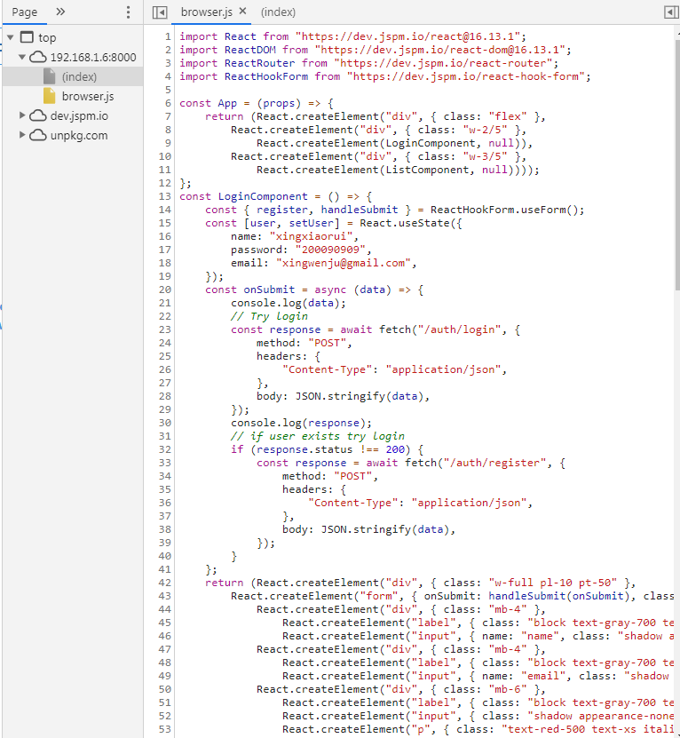

浏览器中打开检查器，在 `source` 面板中打开 `browser.js`，最终代码是这样的

## 四、调试 Deno

Deno 支持 V8 Inspector Protocol。使用 Chrome Devtools 或其他支持该协议的客户端（比如 VSCode）能够调试 Deno 程序。要启用调试功能，用 --inspect 或 --inspect-brk 选项运行 Deno，对应的选项描述如下：

--inspect=<HOST:PORT>
activate inspector on host:port (default: 127.0.0.1:9229)

--inspect-brk=<HOST:PORT>
activate inspector on host:port and break at start of user script

复制代码--inspect 选项允许在任何时间点连接调试器，而 --inspect-brk 选项会等待调试器连接，在第一行代码处暂停执行。

### （一）Chrome Devtools

让我们用 Chrome 开发者工具来调试

使用 `--inspect-brk` 选项，在第一行代码处暂停执行。

```bash
deno run --inspect-brk -A server.ts
```

复制代码打开 `chrome://inspect`，点击 `Target` 旁边的 `Inspect`

进一步了解更详细的调试说明，可访问 `deno.land/manual` 地址。

### （二）VSCode

Deno 可以在 VSCode 中调试。插件的官方支持正在开发中

在 `launch.json` 中配置如下

```json
{
  "version": "0.2.0",
  "configurations": [
    {
      "name": "Deno",
      "type": "node",
      "request": "launch",
      "cwd": "${workspaceFolder}",
      "runtimeExecutable": "deno",
      "runtimeArgs": ["run", "--inspect-brk", "-A", "<entry_point>"],
      "port": 9229
    }
  ]
}
```

## 源码地址

Github 地址： <https://github.com/linuxing3/deno-game-monitor>

## 更多参考资源

- 阮一峰的网络日志 <https://www.ruanyifeng.com/blog/2020/01/deno-intro.html>

- Deno 官方网站 <https://deno.land>

- API 文档 <https://doc.deno.land> 和 <https://deno.land/typedoc>

- awesome-deno <https://github.com/denolib/awesome-deno>

- 阿西河 <https://www.axihe.com/edu/deno/home.html>

- Deno 中文手册 <https://nugine.github.io/deno-manual-cn/introduction.html>
